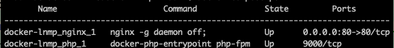

# README


### 本地 hosts 文件配置参考 请先配置本地host

```bash
127.0.0.1 xx.xx.xx
```


### 按照如下步骤安装 `docker-lnmp` 

步骤一：进入项目中，从模版文件中复制，命令如下：

```bash
$ cp .env.dist .env
$ cp docker-compose.yml.dist docker-compose.yml
```


步骤二：设置项目路径

打开 `.env` 文件，如果没有则新建。录入以下内容

```text
APP_ROOT=所有项目的绝对路径
```

> 解释：如果您是 Linux 系统，所有项目位于路径 `~/workspace/sites`，则填写 `~/workspace/sites`。如果您是 Windows 系统，
  所有项目位于 `D:\workspace\sites`，则填写 `D:\workspace\sites`。

步骤三：使用 docker-compose 构建镜像（注意由于国内环境问题此处可能会失败，失败了在重复执行）

```bash
docker-compose build
```

> ps: 需要安装 docker 及 docker-compose

步骤四：启动所有服务

```bash
docker-compose up -d
```
这个时候使用如下命令检查一下

```$xslt
docker-compose ps 
```
显示结果如图,然后打开（确保配置好host） http://phpinfo.yunya.com 可以正常访问则为正常  




恭喜你你已经安装好了我们的docker开发环境


### 容器内部执行相关
如果需要进入内部执行composer,init,yii等相关脚本，参考如下命令
```$xslt
cd /path/to/docker-lnmp
docker-compose exec php bash

# 打开对应项目执行相关命令，这里的php是docker-compose.yml中的服务名。
```
> PS: 使用 Windows 的用户，如若出现 `the input device is not a TTY.  If you are using mintty, try prefixing the command with 'winpty'
` 这个错误，则执行命令为 `winpty docker-compose exec php bash`

### xdebug相关
需要打开`path/to/docker-lnmp/docker/php7-fpm/etc/xdebug.ini`修改`xdebug.remote_host=`为你的本机ip


### 常用命令索引

#### 基于 docker 管理镜像、容器、数据卷等

- 获取 docker 命令帮助 `docker -h`
- 停止容器 `docker container stop 容器名或容器 ID`
- 启动容器 `docker container start 容器名或容器 ID`
- 重启容器 `docker container restart 容器名或容器 ID`
- 创建网络 `docker network create nginx-proxy` 将会创建一个名为 nginx-proxy 的网络，并使用默认的驱动 bridge
- 查看网络 `docker netowrk ls` 将会列出所有网络
- 删除网络 `docker netowrk rm nginx-proxy` 将会删除名为 nginx-proxy 的网络，如果遇到无法删除，可能是因为此网络正在被占用

#### 基于 docker-compose

使用 docker-compose 命令，请确保此目录下有 docker-compose.yml，或使用 docker-compose -f 文件名 指定 docker-compose.yml 配置文件。

- 构建镜像 `docker-compose build`
- 拉取最新的基础镜像进行构建 `docker-compose build --pull`
- 启动所有服务 `docker-compose up`
- 重启所有服务 `docker-compose restart`
- 启动并重新构建镜像 `docker-compose up --build`
- 停止所有服务 `docker-compose down/stop`

### 添加本地 nginx 测试站点

在 `docker/nginx/etc` 目录下，新建目录 `local-sites-enabled` ，里面的所有站点配置文件，会被加载，且不会提交到仓库。
